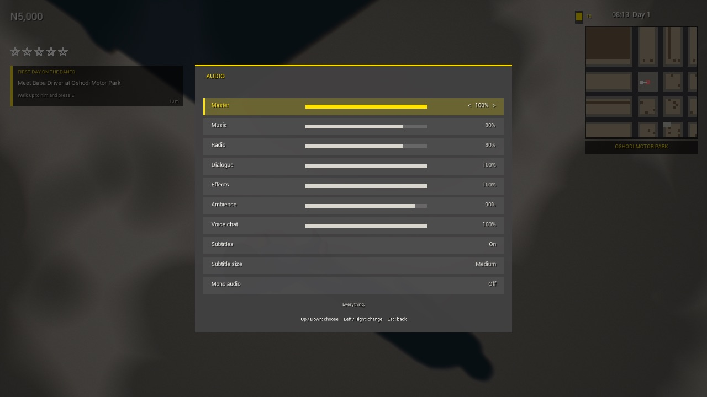
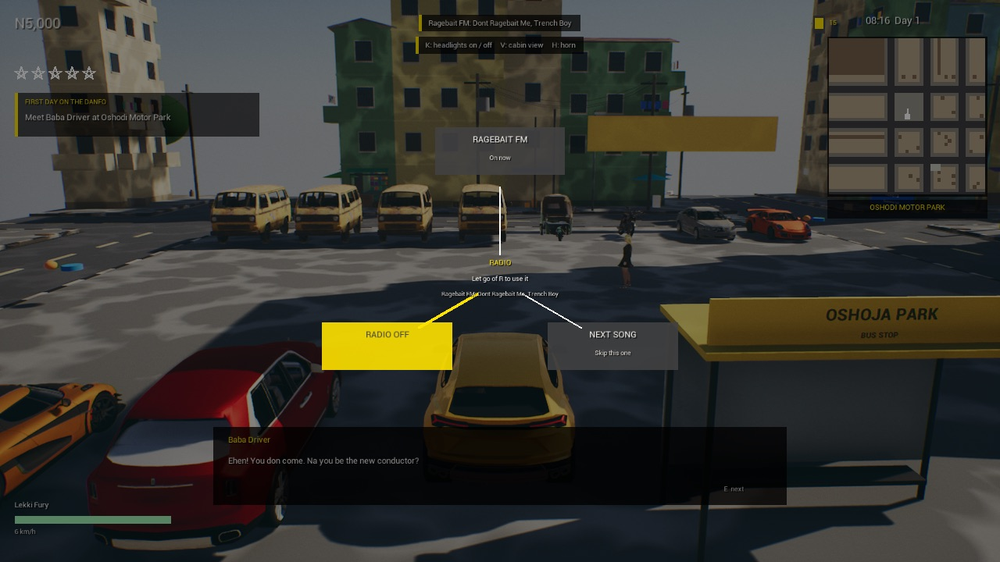
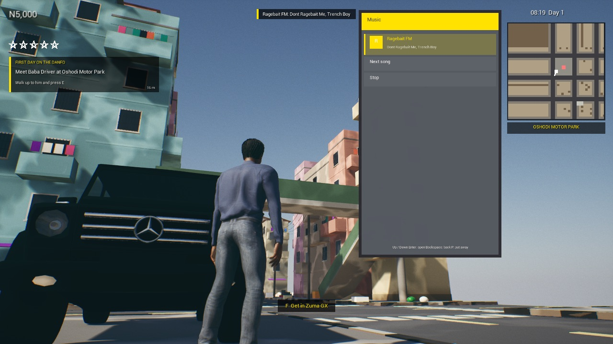

# Audio (audio brief, step 1: architecture)

**Date:** 2026-10-09 · **Machine:** Apple M1, 8 GB · **Branch:** `lagos-real-city`

Step 1 of ten. This is the mix every later sound will go through. **The game still has no sounds of its own**: the
only things that make noise are the placeholder test tones the audio check plays.

## What is in

Everything is made in code the first time a level plays (`UNHAudioSubsystem`), because `Content/` is not in the
repo. There are no audio assets and nothing to import.

- **Sound Classes:** Master > Music, Radio, Dialogue (> Barks), SFX (> Vehicles, Weapons, Footsteps, UI, Phone),
  Ambience, Voice Chat. Barks is the one class the brief does not name: a passer-by shouting has to follow the
  Dialogue slider without ducking the music the way a mission line does.
- **Submixes:** Music, Radio, Dialogue, World, UI, Voice, under the engine's main submix.
- **Reverb and EQ for six spaces** (street, market, motor park, interior, under a bridge, tunnel) on the World
  submix. See "One reverb, not six" below.
- **Sound Mixes (ducking):**

  | Mix | When | What it does |
  |---|---|---|
  | Dialogue | a sound plays in the Dialogue class, or a mission line is on screen | Music 0.45, Radio 0.4, Ambience 0.55 |
  | Phone call | a call is being spoken | Music 0.2, Radio 0.2, Ambience 0.3, Dialogue 0.5, effects 0.4, UI 0.6, Voice chat 0.5; the Phone class is untouched |
  | Cabin | sitting in a closed car (not an okada or a keke, and not with a broken window) | Ambience 0.6 and dulled above 2.8 kHz; weapons, footsteps and barks likewise |
  | Radio muffled | the radio is playing in a car you are not in | Radio 0.45 and nothing above 900 Hz |

- **Occlusion:** a wall between a sound and the listener makes it quieter (0.55) and duller (1.4 kHz), fading over
  0.3 s. One simple ray per sound.
- **Attenuation, concurrency and priority** for 18 kinds of sound (`ENHSoundKind`): how far each carries, how many
  may sound at once, and who gives way. 32 voices at most on the Mac.
- **Audio Gameplay Volumes** (`ANHAudioZone`): a box that gives the World submix a space while the listener is in
  it, and, for an indoor zone, muffles the street from inside and the room from outside. The game makes two in the
  city: the motor park (from its bays) and a market by the Oshodi stop. Where there is no zone the space comes from
  what is overhead: a slab above with walls all round is an interior, a low one with walls on two sides a tunnel,
  anything else a bridge.
- **Settings:** pause menu, Audio. Seven volume sliders (Master, Music, Radio, Dialogue, Effects, Ambience, Voice
  chat), Subtitles on/off, Subtitle size (small, medium, large), Mono audio. Remembered in `GameUserSettings.ini`.



## For the code that plays sounds (steps 2 onward)

```cpp
UNHAudioSubsystem* Audio = UNHAudioSubsystem::Get(this);
Audio->Play(Sound, ENHSoundKind::UI);                          // not in the world
Audio->PlayAt(Sound, ENHSoundKind::Horn, Location);            // in the world
Audio->PlayAttached(Sound, ENHSoundKind::VehicleEngine, Mesh); // follows something
```

The kind picks the class, submix, attenuation, concurrency and priority. Console: `NHAudio` prints the state,
`NHAudioSpace Tunnel` holds a space (`NHAudioSpace auto` gives it back), `NHAudioTest` runs the check below.

## Three things that differ from the brief, and why

- **One reverb, not six.** The brief asks for a submix with reverb and EQ for each space. There is one World submix
  with one EQ and one reverb, and their settings glide to the space the listener is in over 1.5 s. Six reverbs
  would each cost what this one does (0.8% of a core) whether or not anything was sounding in them, and Unreal has
  no way to send every world sound to "the submix of wherever the listener is" without setting sends sound by sound.
- **A sound's submix is stamped on the sound.** Unreal takes the base submix from the sound asset, not from its
  class or its component, so `Play` sets it the first time a sound is played. A sound that already names a submix
  keeps it.
- **Subtitles off does nothing yet.** No line in the game has a recorded voice, and a line nobody can hear or read
  cannot be followed, so lines without a voice are always shown. The switch takes effect for voiced lines in
  step 5. Subtitle size works now.

## The check

`ANHAudioTest` plays placeholder tones through the mix, one situation after another, and records what comes out of
the speakers. `Scripts/audio_check.py` then measures the recording.

```
Scripts/mac.sh city -NHAudioTest
python3 Plugins/NaijaHustleGame/Scripts/audio_check.py Saved/NHAudio
```

**21 of 21 checks passed**, at the Oshodi stop in `L_Lagos_City` (`-NHAudioAt=oshoja`) and in `L_Slice_Street`:

| Check | Expected | Measured |
|---|---|---|
| Music under a line of dialogue | 0.45 of its level | 0.45 |
| Music after the line | back to 1.00 | 1.00 |
| Music under a phone call | 0.20 | 0.20 |
| Music slider at 50% | 0.50 | 0.50 |
| Music 50% and Master 50% | 0.25 | 0.25 |
| Muffled radio, above 4 kHz | most of it gone | 0.07 of clear |
| Muffled radio, 250 to 700 Hz | 0.45 | 0.46 |
| A tone 4 m to the right | louder in the right ear | right 0.110, left 0.0003 |
| The same with Mono on | equal | 0.055 and 0.055 |
| A 3 kHz tone 8.5 m ahead, then a wall in the way | cut | 0.23 of clear |
| A burst of hiss, ringing after it: street, then tunnel | longer in the tunnel | 11 times the street's |
| Forty horns at once | no more than the kind allows (4) | 4 sounding |

At the Oshodi stop the listener is inside both zones and the market wins: the test began in the Market space.

The recording is `docs/clips/audio-step1-oshodi.m4a` (46 s, test tones only): music tone, the line and the call ducking it, the sliders, the radio clear then muffled, a tone on the right then in mono, a tone then a wall, a burst in the street then in the tunnel, forty horns. Audio only: there is nothing on screen to see yet, and the Mac has no `ffmpeg` to make a video with.

## Measured

Over the 46 seconds of the check at the Oshodi stop:

| | |
|---|---|
| Audio rendering | 1.6% of one core (reverb 0.7%, EQ 0.2%) |
| Voices | 4 at most, of a budget of 32 |
| Frame | 35 ms on average, the same as without the test |
| Audio on disk | no assets; 77 KB of source |
| Audio in memory | no samples loaded. The whole game was using 5.1 GB; audio's own share was not measured |

The disk budget and the 20 largest assets belong to step 8, when there are assets.

## The radio (brought forward from step 6)

One station so far, **Ragebait FM**: "Dont Ragebait Me" (Trench Boy) and "Bands" (Tommy Ringz), round and round.

- **In a car:** hold `R` for the radio wheel (like the inventory wheel): point at a station, Next song or Radio
  off, and let go. `T` also skips a song. On a gamepad, D-pad right steps through the stations. The station and
  song show at the top of the screen.
- **On the phone:** the Music app plays any station anywhere, with Next song and Stop. It is one radio: picking a
  station on the phone takes the music from the car, and the other way round.

| Radio wheel | Music app |
|---|---|
|  |  |

- **The radio stays with the car.** Get out and the same song carries on from the same place, heard from the car:
  quieter, placed where the car is, and with its top end gone (the Radio muffled mix).
- **Adding a station or a song:** an entry in `Data/radio_stations.json`, the WAV in
  `~/Downloads/nh-radio/<station>/`, `Scripts/mac.sh script <plugin>/Scripts/import_radio.py`, and a line in
  `MUSIC_LICENSES.md`. No audio goes in the repo.
- **Checked** by `Scripts/mac.sh play -NHRadioTest`, which gets into a car, turns the radio on, gets out, skips a
  song and records it: in the car the level was 0.041 in full stereo; outside 0.013, to one side, with 8% of the
  top end left; the second song then played.
- **Not yet:** DJs, adverts, the other stations, radio in shops, radio from passing cars, a gamepad button for
  the next song or the wheel. On disk the two songs are 26 MB in the project.

## Weapon sounds (brought forward from step 4)

The machete, the pistol and the AK-47 can be used and heard. On foot with one in hand, the **left mouse button**
fires or swings: one shot a press for the pistol, 600 rounds a minute while held for the AK-47, one swing a press
for the machete.

- **Every sound is original and made by arithmetic** (`NHWeaponSounds`): noise, a few sine waves and filters,
  worked out the first time each is needed. No recording, no file, nothing taken from another game. Three takes of
  each, never the same one twice running, and the pitch moves a little each time.
- **Nine sounds:** pistol shot and its echo off the street, rifle shot and its echo, a bullet landing, the machete's
  swing, the machete on something hard, a gun drawn or put away, the blade drawn or put away.
- A shot is two sounds: the bang at the gun (Weapon kind: carries 126 m, walls muffle it) and the echo (WeaponTail
  kind: carries 320 m, nothing muffles it). The bullet's knock is heard where the camera was pointing, up to 150 m.
- **Checked** by `Scripts/mac.sh play -NHWeaponTest`: 3 pistol shots, a second of AK-47, 2 machete swings, recorded
  as `docs/clips/weapons-pistol-ak47-machete.m4a`.
- **Damage:** a bullet takes 45 (pistol) or 38 (AK-47) of a person's 100, the machete 60; at nothing they fall,
  lie there half a minute and are gone. Everybody within 45 m of a gunshot runs, some with a shout; a blade only
  scares those within 15 m. Vehicles lose 6, 9 or 4 of their health and are wrecks at nothing. Baba Driver cannot be
  hurt. Wanted stars: a little for every shot, more for a hit, most for a death. Checked by
  `Scripts/mac.sh play -NHDamageTest`: 2 s of AK-47 into 12 passers-by gave 6 hits, 2 down, 10 running, 5 stars.
- **Not yet:** anybody fighting back or police arriving, ammunition and reloads, shell casings,
  ricochets, different knocks for different surfaces, aiming, recoil, animations (the arm does not move; the
  machete itself chops), any of it on a gamepad. These are stand-ins for recorded and designed sounds.

## Engine traps found on the way

- A submix made in code with default reverb settings is silent: `FSubmixEffectReverbSettings::Gain` (the late
  reverb's level) defaults to 0.
- A submix effect preset copies its `Settings` property over anything `SetSettings` gave it the first time it is
  used. Set both.
- A sound class's `DefaultSubmix` is not used for routing at run time.
- An Audio Gameplay Volume only looks for the listener if one of its mutator components is active, and they do
  not activate themselves.
- A submix left to auto-disable lost sounds that begin with a moment of silence when nothing else was playing.
  The game's six stay awake.

## Not in step 1

Every actual sound: ambience (step 2), vehicles (3), characters and combat (4), music and UI (7), dialogue and
voices (5), radio (6), compression and budgets for real assets (8), proximity voice chat (10). MetaSounds and
Quartz start in steps 2, 3 and 7, where there is something for them to make.
