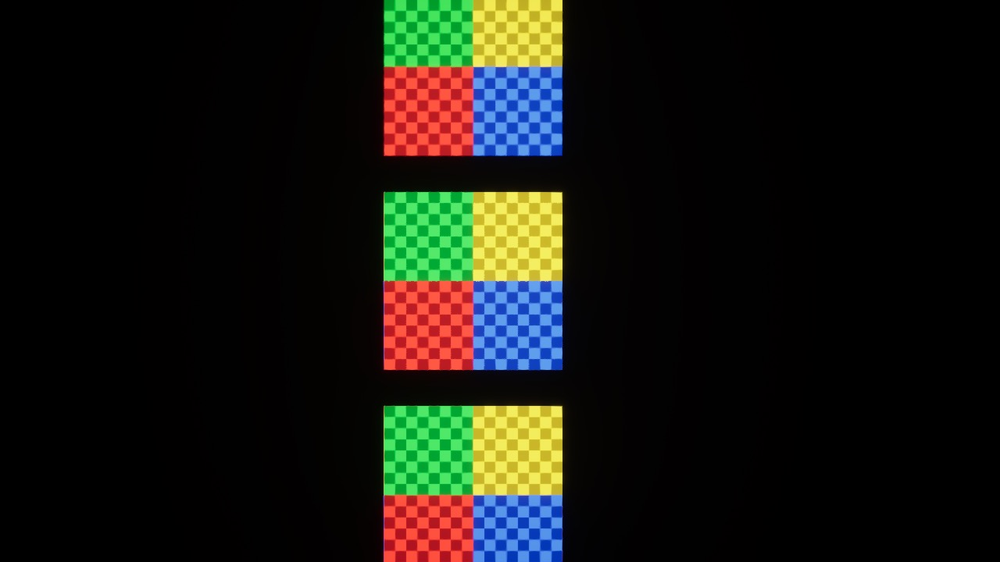

# Engine features on the M1 8 GB Mac (Lagos look brief, section 1)

**Date:** 2026-10-09 · **Machine:** MacBook Pro, Apple M1, 8 GB, macOS 27.2 · **Engine:** UE 5.8 (launcher build)

| Feature | On this Mac | How it was established |
|---|---|---|
| **Nanite** | **Not available.** Meshes draw as ordinary meshes with their LODs. | The engine only starts Metal SM6 on an Apple8-family GPU, which is M2 or later (`MetalRHI.cpp`: "A M2+ Mac Apple GPU is required for SM6"). This M1 runs Metal SM5: every game log says `shaderplatform="METAL_SM5"`. The engine's platform table marks SM5 `bSupportsNanite=false` (`Engine/Config/Mac/DataDrivenPlatformInfo.ini`). A cube saved with Nanite switched on still loaded and drew, as its fallback mesh. |
| **Streaming Virtual Textures** | **Work.** | Render test: the same picture as a plain texture and as a virtual texture (`virtual_texture_streaming` on, sampled as Virtual Color) drew identically. |
| **Runtime Virtual Texture** | **Works.** | Render test: one surface wrote the picture into an RVT (drawn only into the RVT, not the main pass); a second surface that only samples the RVT showed it. |
| **Lumen** | Supported by SM5 on paper, but the project already turns it off on machines with 8 GB or less (it ran out of memory). | Earlier work, see `PROGRESS.md`. |
| **Virtual Shadow Maps** | Not active (they need Nanite's path); shadows are cascaded shadow maps. | Earlier work. |
| **Variable Rate Shading** | Not supported (`LogVRS: Current RHI does not support Variable Rate Shading`). | Test log. |
| **Hardware ray tracing** | Not supported on SM5. | Platform table. |

Three planes from above, in a blank project: a plain texture (the control), the same as a Streaming Virtual Texture,
and a surface showing a Runtime Virtual Texture. All three show the picture.

## What this means for the brief

- **Nanite is for the cloud PC only.** On the Mac the city needs real LODs: auto-generated LODs on every mesh, and HLOD for the distance. Anything authored with Nanite-level triangle counts must have a fallback budgeted for the Mac, or the Mac build will crawl. Keep `r.Nanite.ProjectEnabled` on (it costs nothing on SM5) so the cloud PC uses it.
- **Streaming Virtual Textures can be used**, for the large shared material library, to keep texture memory bounded. They are untested here at scale: this was one 1K texture in the editor, not a city in a packaged build.
- **Runtime Virtual Textures can be used** for ground blending (roads into dirt, grime at building bases). Same caveat.
- Not measured: the frame-rate cost of either on this Mac, and whether they behave in a cooked build. Both need measuring on the real level before the material library (section 4) commits to them.

## State of World Partition and HLOD

- `L_Lagos_City` is a World Partition level as of 2026-10-09 (one file per actor; ground, roads and bridges always loaded; buildings and trees by cell). Measured on this Mac at 1280×720: memory footprint 2.4 GB, down from 7.9 GB; level load 8 to 32 s. Frame rate read 19 fps standing still against 39 before; that has not been re-measured and may have been cells still loading. That work is in the working tree and not committed yet.
- HLOD is not built. Two default HLOD layers exist on the level (instanced and merged). Building them is a job for the cloud PC.

## Disk, today

| What | Size |
|---|---|
| `unreal/NaijaHustle` in all | 3.4 GB |
| `Content` | 2.0 GB |
| …`Content/Characters` (mannequin, MakeHuman people, wardrobe) | 1.2 GB |
| …`Content/Lagos` (the city's meshes, textures, materials) | 549 MB |
| …`Content/Vehicles` | 112 MB |
| …`Content/__ExternalActors__` (one file per placed actor) | 72 MB |
| `Intermediate` (build products) | 546 MB |

No packaged build exists yet, so there is no packaged size to report.

## How to repeat the render test

A blank project (`Templates/TP_BlankBP`) with `r.VirtualTextures=True`, three planes with unlit materials as above, a
top-down screenshot. It was done in a scratch project outside this repo so as not to disturb it. A new project
takes about 20 minutes to compile its shaders on this Mac before the first frame.
