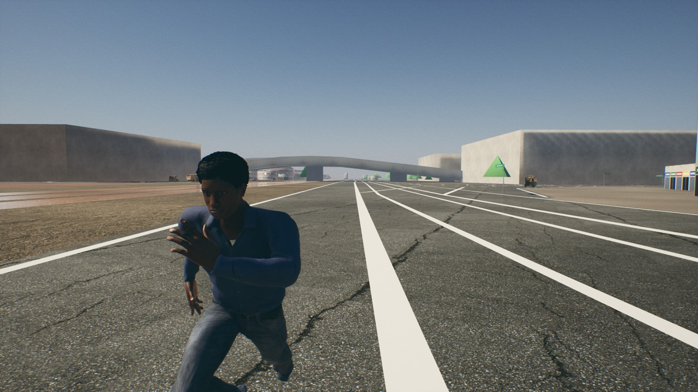

# Material library (Lagos look brief, section 4)

**Date:** 2026-10-09 · **Machine:** Apple M1, 8 GB · **Branch:** `lagos-real-city`

## What is in

- **47 surfaces**, each three textures: base colour, normal, and one packed map (occlusion in red, roughness in
  green, metallic in blue). 17 for roads and ground, 30 for walls, roofs, shutters, wood and tiles.
  Nine hero surfaces are 2K, the other 38 are 1K.
- **Two master materials**, built by script, and one material instance for each surface (`MI_<Name>`).
- **The city's roads, bridges, rail beds and open ground now use them:** 1,104 meshes, ten material slots.

## Where the textures come from

Poly Haven (polyhaven.com), licence CC0. They are **stand-ins for the Megascans surfaces the brief asks for**:
Megascans needs the project owner's Fab account, which I do not have. A Megascans surface saved in the same folder
layout (`<Name>/BaseColor.jpg`, `Normal.jpg`, `ORM.jpg`) imports the same way and replaces the stand-in.

None of them is a photograph of Lagos. The choice was made by name and by eye, not against reference photos.

## How to rebuild

1. `python3 Scripts/fetch_surfaces_polyhaven.py` downloads the textures to `~/Downloads/nh-surfaces` (165 MB, outside the project).
2. `Scripts/mac.sh script <plugin>/Scripts/import_surfaces.py` imports them and builds everything under
   `/Game/NaijaHustle/Surfaces`. Set `NH_SURFACE_STAGE=city` to redo only the step that puts surfaces on the Lagos map.

The imported textures and materials are generated, so they are not in the repo.

## The two master materials

| Master | Used for | Controls on each instance |
|---|---|---|
| `M_NH_Ground` | roads, pavements, earth | `TileSize` (cm; textures are laid by world position, so neighbouring road pieces line up without seams), `Variation` and `VariationSize` (large light and dark patches that hide repetition), wetness and puddles from the weather |
| `M_NH_Building` | walls, roofs, shutters | `Tiling`, tint and `TintVariation` (each building a slightly different shade), `VertexColourAmount`, `PaintFade`, `Grime` and `GrimeHeight` (dirt rising from `GroundZ`), `RainStreaks` with `StreakWidth` and `StreakLength`, `Moss`, `Dust`, wetness from the weather |

Wetness and puddles read the existing `MPC_NHWeather`, so the lighting rig's rain already drives them.

## Which surface went where

| Map slot | Surface | Tile |
|---|---|---|
| Expressways and trunk roads | Asphalt (grey, cracked) | 6 m |
| Streets | Asphalt_Patched | 4.5 m |
| Service roads | Laterite | 5 m |
| Bridge decks | Concrete_Floor_Worn | 5 m |
| Rail beds | Gravel_Road | 4 m |
| Open ground | Laterite_Dry | 9 m |
| Bare sand | Red_Sand | 8 m |
| Parking | Concrete_Pavement_Worn | 5 m |
| Industrial yards | Concrete_Floor_Worn | 7 m |
| Commercial ground | Concrete_Pavement | 5 m |

## Measured

Standalone game, 1280×720, Oshodi expressway (the spot in the picture).

| | Value |
|---|---|
| Frame rate, standing still | 33.8 fps (29.6 ms). Measured with the first road surface; not re-measured after the expressway was switched to the grey asphalt. |
| Memory | 5.2 GB, peak 6.1 GB while loading |
| `Content/NaijaHustle/Surfaces` | 160 MB |
| `Content` in total | 2.1 GB |
| Project folder in total | 3.6 GB |
| Material errors in the log | none |

## Not done

- **The building master is on no building yet.** City facades still use the old `M_Facade_*` materials. The instances are ready for the building generator (a later section).
- **No Megascans**, as above.
- **Edge wear** and **streaks placed under windows and ledges**: the streaks are a general pattern down the wall, not tied to where windows are.
- **Road markings** are still the flat white strips of the Blender model; they have no wear.
- The rain, moss and grime controls have been compiled but **only the dry state has been looked at in game**.
- 38 of the 47 surfaces are 1K. That is deliberate for the 8 GB Mac; the fetch script's `TIER` table changes it.
