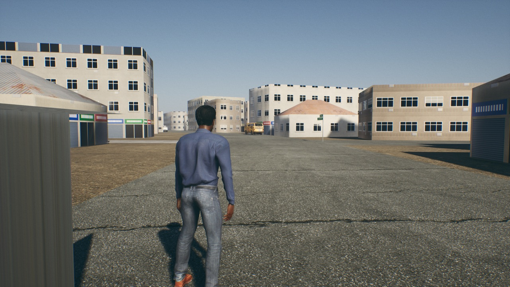
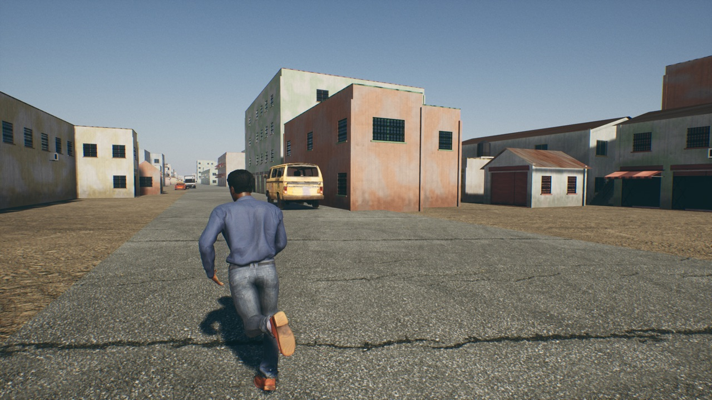
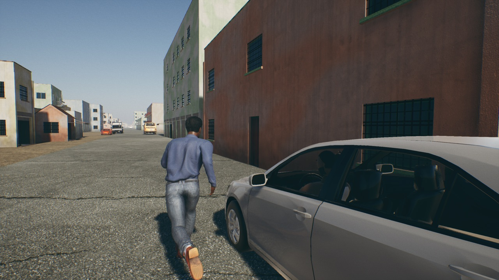

# Modular building kit and generator (Lagos look brief, section 6)

**Date:** 2026-10-09 · **Machine:** Apple M1, 8 GB · **Branch:** `lagos-real-city`

## What is in

- **A kit of 17 pieces**, modelled by script (`Scripts/build_kit.py`), 726 triangles in all, on a 3 m grid: a piece is one 3 m panel of one 3 m storey.
- **A generator**, the `ANHKitBlock` actor, which puts buildings together from the kit given only an outline, a number of storeys and a seed.
- **One 600 m cell of Oshodi rebuilt with it**: 1,009 buildings round Adeyemi, Olaiya and Adesanya Streets, from OpenStreetMap's outlines (`Scripts/place_kit_block.py`). The cell's old buildings from the Blender model are switched off, not deleted.

| Before: the Blender model's buildings | After: the kit, same street |
|---|---|
|  |  |

The two pictures are from the same spot on Adeyemi Street but the camera had turned a little between them.

## The pieces

| Kind | Pieces |
|---|---|
| Walls | plain, sliding window, window with burglar bars, louvre window with bars, door with step, balcony with door and railing |
| Shopfronts | closed roller shutter, open shop with folding gate, awning |
| Structure | corner pilaster, parapet |
| Roofs | zinc gable module, gable end, flat-roof triangle |
| Extras | water tank on a stand, air-conditioner unit, outside stair |

No piece has a texture of its own. Walls use the section 4 building material; frames, bars, louvres, shutters, gates,
ledges and awnings are strips of the section 5 trim sheets; glass, tanks and the like are plain colours.

## How a building is made

- **Walls:** each wall of the outline is filled with whole panels, stretched or squeezed a little to fit its length. Upper storeys repeat the column below, so windows line up.
- **Front:** the wall nearest a street gets the shops (55% of buildings), or the front door, and the balconies.
- **Roof:** small square buildings of one or two storeys mostly get a zinc gable roof with eaves; everything else gets a flat roof behind a parapet, laid in triangles so it fits any outline, with a water tank on about half.
- **Colour:** each building gets one of 12 wall paints, a fade amount, and one of 7 colours for its metalwork and cloth. These reach the materials as per-instance data, so there is still one wall material for the whole city.
- **Storeys:** OpenStreetMap's figure where it has one; almost never in Oshodi, so by floor area: under 60 m² one storey, up to 200 m² one to three, up to 600 m² two to five, larger one to six. In this cell: 397 of one storey, 324 of two, 190 of three, 67 of four, 31 of five.
- **Seed:** made from the building's position, so every run gives the same city. Change a building's `Seed` in the editor for another variant.

## What is stored

Only the outlines, storeys, front wall and seed: about 250 bytes a building. The 68,037 kit pieces of this cell are
worked out again each time a block loads and are never saved.

| | Size |
|---|---|
| The kit (`Content/NaijaHustle/Kit`): 17 meshes and 9 materials | 1.5 MB |
| This cell's 1,009 buildings (4 block actors) | 254 KB |
| `Content` in total | 2.1 GB (unchanged) |
| Project folder in total | 3.6 GB (unchanged) |

## Measured

Standalone game, 1280×720, standing on Adeyemi Street, 15-second average.

| | Frame rate | Memory |
|---|---|---|
| Old buildings (Blender model) | 30.2 fps (33.1 ms) | 6.0 GB |
| Kit buildings | 27.8 fps (36.0 ms) | 6.2 GB |

**The kit is 2.4 fps slower here and under the 30 fps target.** This cell is the densest kind of area in the map.
The first version gave every panel its own collision and used 6.6 GB; one unseen box a wall replaced that. Small
pieces (AC units, awnings, tanks, stairs, pilasters) are not drawn beyond 150 m and cast no shadow; that made no
measurable difference. What should help, not yet done: simpler far versions of the panels (LODs), and HLOD for
distant cells.

## How to rebuild

1. `python3 Scripts/build_kit.py` writes the 17 pieces to `~/Downloads/nh-kit` (93 KB, outside the project).
2. `Scripts/mac.sh script <plugin>/Scripts/import_kit.py` imports them (after `import_surfaces.py` and `import_trims_decals.py`).
3. `Scripts/mac.sh build`, then `Scripts/mac.sh script <plugin>/Scripts/place_kit_block.py` builds a cell: `NH_KIT_CELL=X,Y` picks it, `NH_KIT_UNDO=1` puts the old buildings back.

The two master materials were changed for the kit (per-building colour, drawing on instances). To rebuild them in
place: `NH_SURFACE_REBUILD=1` with `import_surfaces.py`, `NH_TRIM_REBUILD=1` with `import_trims_decals.py`.

## Not done, and what to know

- **It is a C++ actor, not a Blueprint or PCG graph.** It does the job the brief describes and its settings are editable in the editor, but it is not something to rewire by hand in a graph.
- **Only one cell is built.** The rest of Oshodi and the city still use the Blender model's buildings.
- **Collision is not tested in play.** Each wall has a blocking box; I have not walked or driven into one. Balconies, stairs and roofs have no collision, and an open shop cannot be walked into.
- **No LODs**, as above.
- **Signboards are blank** frames, and there are **no wall decals** yet (posters, notices): placing those on kit walls is now possible but not done.
- **Buildings stand where OpenStreetMap puts them, which is not where the Blender model had them**: the before and after pictures show different buildings in different places. Where an outline overlaps a road or another outline, so does the building.
- **The ground is taken as flat** at the level's land height. A doorstep reaches 30 cm below ground; steeper sites would show gaps.
- **Front walls** are found from Oshodi's street data only; in a cell with no street data the longest wall is used.
- **Flat-roof concrete is stretched** differently on each roof triangle; from the street it does not show.
- **Not matched to photos.** Proportions and colours are from general knowledge of Lagos buildings, not from references.
- A third trim sheet (roof services) was not needed for these pieces and has not been made.
