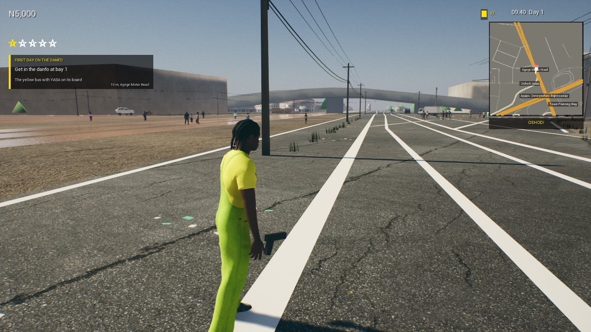

# Traffic and people round the player (living-Lagos brief, step 2: 2.1, 2.2, 2.3)

**Date:** 2026-10-09 · **Machine:** Apple M1, 8 GB · **Branch:** `lagos-real-city`

## What is in

- **2.1 The bubble.** Vehicles and pedestrians exist only round the player. Traffic is made 90 to 260 m off and
  removed beyond 360 m; at speed it is made up to half as far again ahead, nothing new is made behind, and what is
  left behind goes at 60% of the distance. **Vehicles are pooled:** one left behind is put away and comes back as
  the next of its type instead of being destroyed and made again. **Pedestrians are new** (`ANHCrowd`): walkers on
  the edges of ordinary streets within 90 m; one left behind is stood somewhere new ahead, not made again.
- **2.2 Zones** (`Data/population_zones.json`). Mainland: danfos, old sedans, kekes, okadas. Island (ten
  districts): SUVs and luxury cars, half as many people on foot. Expressways (any motorway or trunk road): trucks,
  sedans, danfos, nobody on foot. Six bands of the day: a quarter of the traffic and a tenth of the people between
  midnight and five, everything at the two rush hours. Police presence and area boys' territory per district were
  already data, in `response_areas.json`.
- **2.3 Few models, many looks.** Never more than eight different vehicle models at once: when the traffic already
  has eight, only more of those are made. Each vehicle's paint is a little more or less faded than the last of its
  colour, and danfos carry one of ten destination boards. Pedestrians are six Nigerian bodies (one in seven is any
  of the eleven), each in clothes and colours picked from the shared wardrobe.

The pause menu's Traffic setting now sets all three:

| Setting | Vehicles moving | Parked | Pedestrians |
|---|---|---|---|
| None | 0 | 0 | 0 |
| Light | 8 | 4 | 8 |
| Normal | 14 | 8 | 16 |
| Heavy | 22 | 10 | 25 |

## Measured

`Scripts/mac.sh city -NHPopulationTest [-NHDensity=3]` stands at Oshodi for 50 seconds, at 9 in the morning (rush
hour), in a 1280×720 window:

| | Normal | Heavy |
|---|---|---|
| Vehicles moving + parked | 14 + 8 | 22 + 10 |
| Vehicle models in use | 6 | 7 to 8 |
| Pedestrians | 16 | 25 |
| Frame | 28 to 30 ms (33 to 35 fps) | 28 to 32 ms (31 to 36 fps) |
| Memory, whole process | 5.3 GB | 5.5 GB |
| Vehicles reused from the pool in 50 s | 14 | 17 |
| Pedestrians stood somewhere new | 12 | 23 |
| Disk | no assets added: code and one 2 KB data file | |

Before this step, at the same spot: 9 moving and 6 parked, no pedestrians, 35 ms a frame.

## Not done, not checked

- **Not checked:** the island and expressway mixes (the test stands in Oshodi), night-time numbers, and the bigger
  bubble at speed (the test stands still).
- **No Mass or instanced crowd beyond the bubble:** past 90 m there is nobody.
- **Looks:** no rust, dirt, stickers, slogans, roof loads or number plates. Those need materials and meshes the
  project does not have; paint fade and destination boards are what code alone could do.
- **The model cap counts types in the traffic**, not what Unreal keeps in memory: a model stays loaded after its
  last vehicle is gone until the engine clears it.
- **No BRT buses** (there is no model), and the zones are a data file, not an Unreal DataTable, like the rest of
  the game's data.
- A parked vehicle that came out of the pool may still have its driver sitting in it.
- Pedestrians walk straight along the street's edge: they do not cross, queue, trade or avoid each other.

## Pedestrians keep off bridges and the middle of the road (2026-10-10)

Pedestrians used to be stood on flyover decks and to walk across carriageways. Now each one is given a stretch of
one street's edge (1.2 to 2.6 m outside the kerb) and walks from one end of it to the other and back. A spot is
refused if a bridge or an expressway runs within 15 m of it or of either end, or if anything solid is more than
2.5 m above the ground there (a deck or a roof).

`Scripts/mac.sh city -NHPopulationTest -NHDensity=3` counts anybody on foot within 12 m of a bridge or expressway
or standing more than 1.5 m above the ground:

| Where | Pedestrians | Misplaced | Frame |
|---|---|---|---|
| The Oshodi stop | 25 | 0 | 27 ms (37 fps) |
| Iganmu (`-NHPopulationDistrict=Iganmu`), on the Apapa Road and Eko Bridge ramps | 0 | 0 | 28 ms (35 fps) |

Nobody at the Iganmu point is the right answer: every road within 90 m of it is a bridge. Not checked by eye in
the running game, and not checked anywhere else in the city.
