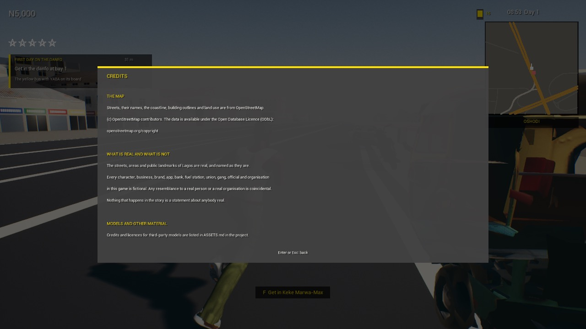

# Real layout and street names (Lagos look brief, section 2)

**Date:** 2026-10-09 · District done: **Oshodi** (6.535–6.575 N, 3.325–3.365 E, about 4.4 km square)

## What exists now

| Thing | Where | Size |
|---|---|---|
| Every street segment of the district with its real name, class, lanes, width, one-way, bridge, roundabout, speed limit and length | `Plugins/NaijaHustleGame/Data/streets_oshodi.csv`, and the DataTable `DT_Streets_Oshodi` (row struct `FNHStreetRow`) made from it by `Scripts/import_streets_table.py` | 149 KB CSV, 725 KB table |
| The same streets' centre lines in Unreal cm, keyed by the same row name ("W" + OpenStreetMap way id); junctions; walkways; rail; waterways and water; parks and pitches; bus stops and signals | `Plugins/NaijaHustleGame/Data/osm_oshodi.json` | 522 KB |
| Every building footprint, with floors and height where known | `~/Downloads/map lagos/OSM/buildings_oshodi.json`: source for the building generator (section 6), deliberately not in the project | 4.0 MB |
| The tool that makes all three, for any district added to its `DISTRICTS` table | `Scripts/build_district_osm.py` | |
| OpenStreetMap attribution and the "everybody is fictional" notice | Pause menu (Esc), Credits | |

## What OpenStreetMap has for Oshodi, and what it does not

| | Count | Note |
|---|---|---|
| Street segments | 1,840, 389 km | service 870, residential 704, tertiary 97, secondary 77, motorway 48, primary 25, others 19 |
| With a name | 417 segments, 202 km, **262 different street names** | Agege Motor Road, Airport Road, Abeokuta Street… The unnamed ones are mostly service roads and short residential streets. |
| Lane counts | 44 segments | For the rest the width is the class's usual width in the city model. |
| Widths | none | OpenStreetMap has no width for any street here. |
| Bridges and overpasses | 31 segments | |
| Roundabouts | 3 segments | |
| Junctions (three or more streets, or two names meeting) | 502 | These are where street signs go (section 3). |
| Rail lines | 5 | |
| Waterways and water | 46 | canals and drains |
| Parks and pitches | 7 | |
| Bus stops, crossings, signals, fuel | 21 | Thin: most real stops are not mapped. |
| Building footprints | 27,599 | **Only 29 have a floor count and 14 a height.** Heights will have to come from rules and from reference photos, not from data. |

## How the table is tied to the roads

The brief asks for the table to be linked to the road splines. There are no road splines: the roads are meshes from
the Blender model, and the game drives on a road graph. The link is the row name. `DT_Streets_Oshodi` row `W92451137`
is the street whose centre line is `streets["W92451137"].pts` in `osm_oshodi.json`. Anything that needs a street's
name at a place (signs, the minimap, the location banner, directions) looks up the nearest centre line and reads its
row. If spline actors are wanted later, they can be generated from the same centre lines with the same keys.

## Not done in this section

- **The game does not use this data yet.** The runtime road graph (`lagos_real.json`) still holds main roads only, city-wide. Section 3 (signs, minimap names, banner, directions) is where the district data gets loaded and used.
- **The map's geometry is unchanged.** Correct widths and lanes, junction shapes and roundabouts are in the data, not in the road meshes, which still come from the Blender model with one width per class.
- **GTA-style compression is not done, and needs a decision** (below).
- Only Oshodi. Other districts are one line each in the tool's table, then a run.

## Decision needed: compressed distances between districts

The map today is all of Lagos at true scale, about 24 by 26 km. The brief asks for real layout inside each district
and compressed distances between them. Those are different maps. Compressing means choosing the districts that
matter, keeping each at true scale, moving them closer together, and building short connecting roads and stretches
of lagoon between them: a new map made in Blender, with the stops, the road graph and the traffic data rebuilt for
it. It is weeks of map work, not a setting.

What I recommend: keep the true-scale map, and get the feel of compression from what loads and what is detailed.
World Partition already means only the district you are in costs memory. Detail budgets (section 9) make hero
districts rich and the stretches between them plain, and DropAm and the danfo's "skip the trip" already let the
player jump the long drives. That keeps every real street where it really is, which is the point of using real
names, and costs nothing new. If true compression is still wanted, the list of districts to keep is the first
thing to settle.

## Measured on the M1 8 GB Mac, 1280×720, `L_Lagos_City`

| | |
|---|---|
| Frame rate, standing still at Oshodi | 35.1 fps (an earlier 19 fps reading was taken while cells were still loading) |
| Memory footprint | 5.0 to 5.9 GB in two runs today, against 2.4 GB measured this morning on the same level. The difference appeared after more player characters were added to the project by other work; it has not been tracked down. |
| Level load | 8 s |
| Project on disk | 3.4 GB; this section added 1.4 MB (data files and the table) |

(c) OpenStreetMap contributors. The data is available under the Open Database Licence.
