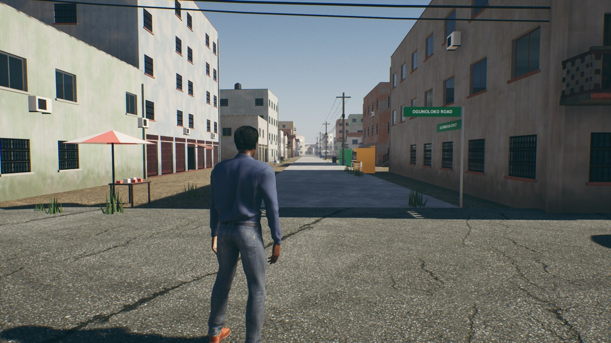

# Procedural street scatter (Lagos look brief, section 7)

**Date:** 2026-10-09 · **Machine:** Apple M1, 8 GB · **Branch:** `lagos-real-city`

## What is in

- **11 street props**, modelled by script (`Scripts/build_props.py`), 1,312 triangles in all: plastic chair, steel drum, generator, kiosk, trader's umbrella and table, power pole, a span of overhead wires, weeds, rubbish bag, litter, rubble.
- **A scatter that runs while you play** (`ANHStreetScatter`): it lays the props along the streets within 160 m of the player and takes them away behind. **Nothing about where they go is stored in the level.**

Olatunbosun Street at Ogunoloko Road: umbrella stall, kiosks, poles and wires, weeds. The buildings are the section 6 kit, the sign is from section 3.

## How it decides

- The world is cut into 100 m tiles. A tile is filled when the player comes within 160 m, one tile every fifth of a second, and emptied beyond 220 m.
- Along every street in the tile it looks at each side every 4 m. What goes there comes from the street and how far along it is, so **the same kiosk is at the same spot every time you come back**.
- **Everywhere:** weeds at the edge of the tar, litter, and a pole every 40 m down one side with wires to the next.
- **On the smaller streets only** (not expressways or main roads): kiosks (some with chairs or a generator), umbrella stalls, rubbish bags, rubble, drums.
- Props keep clear of junctions, and nothing is put inside a building or on a car: each is dropped by a ray from above and skipped if something is in the way. Kiosks and stalls also need clear room round them.
- Chairs, drums, kiosks, bags, generators and umbrellas each take a colour from a short list, passed to one shared material.

Around the player on Olatunbosun Street it placed **785 props in 7 tiles**: 562 weeds, 102 litter, 35 poles, 30 wire spans, 24 rubbish bags, 11 chairs, 6 umbrella stalls, 5 kiosks, 5 drums, 2 generators, 2 rubble heaps.

## Measured

Standalone game, 1280×720, standing on Olatunbosun Street, 15-second average.

| | Frame rate | Memory |
|---|---|---|
| Scatter off (`-NHNoScatter`) | 36.5 fps (27.4 ms) | 5.1 GB |
| Scatter on, run 1 | 36.8 fps (27.2 ms) | 5.2 GB |
| Scatter on, run 2 | 35.5 fps (28.2 ms) | 6.2 GB |

The scatter costs **about 1 fps at most**; the two "on" runs differ from each other by more than that. The memory
readings of the two identical runs differ by 1 GB, so I cannot give the scatter a memory cost from these: it is
smaller than the run-to-run spread on this Mac.

| | Size |
|---|---|
| The props (`Content/NaijaHustle/Props`): 11 meshes and their materials | 980 KB |
| Placement data stored | none |
| `Content` in total | 2.1 GB (unchanged) |
| Project folder in total | 3.6 GB (unchanged) |

## How to rebuild

1. `python3 Scripts/build_props.py` writes the props to `~/Downloads/nh-props` (124 KB, outside the project).
2. `NH_KIT_SET=props Scripts/mac.sh script <plugin>/Scripts/import_kit.py` imports them (after the kit, whose plain materials they share).
3. `Scripts/mac.sh build`. The game mode starts the scatter in the real-scale city; `-NHNoScatter` on the command line leaves it out.

`Reach`, `Slack` and `Density` on the actor change how far it reaches and how much it lays.

## Not done, and what to know

- **It is C++, not PCG graphs.** The PCG plugin is not switched on in this project and I did not test it. The brief asked for PCG graphs and for a test of runtime generation; this does the runtime generation directly and stores nothing, but there is no graph to edit by hand. If you want PCG for hand-placed hero areas, that is a separate piece of work.
- **Only where there is street data**, which today is Oshodi. Elsewhere in the city nothing is scattered.
- **Seen from one street in one run.** I looked at two screenshots. I have not walked the district, so I have not checked for props in bad places: on a parked car's bay, half inside a wall, on a bridge.
- **Collision:** kiosks, drums and generators block; poles, stalls and chairs do not, so a car passes through a pole. Not tested by driving into anything.
- **Traffic and pedestrians do not know about the props.**
- **"Weeds in cracks":** the weeds follow the edge of the tar, not the crack decals.
- **Kiosks have no signs or goods beyond plain coloured boxes**; names and brands wait for the sign work.
- **Wires run pole to pole along one side** and do not cross the street or run to buildings.
- **The props are simple shapes** (a chair is 90 triangles) with flat colours: right for filling a street, not for a close-up.
- **Not matched to photos.**
