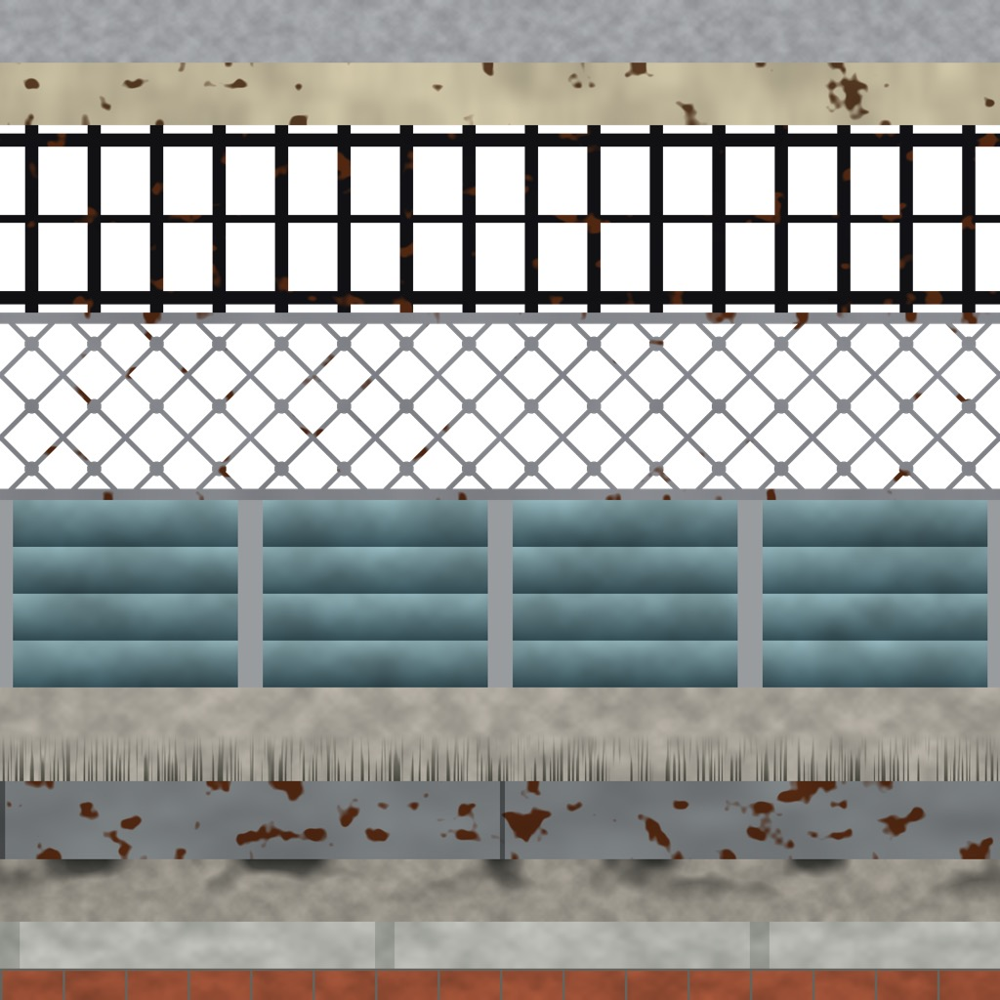
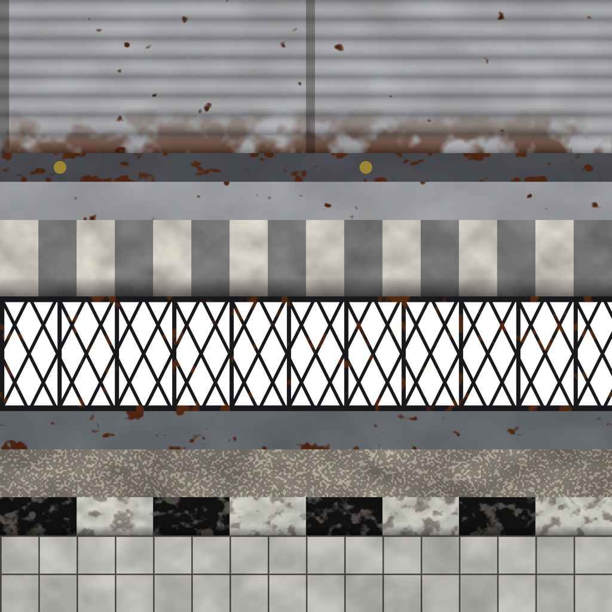
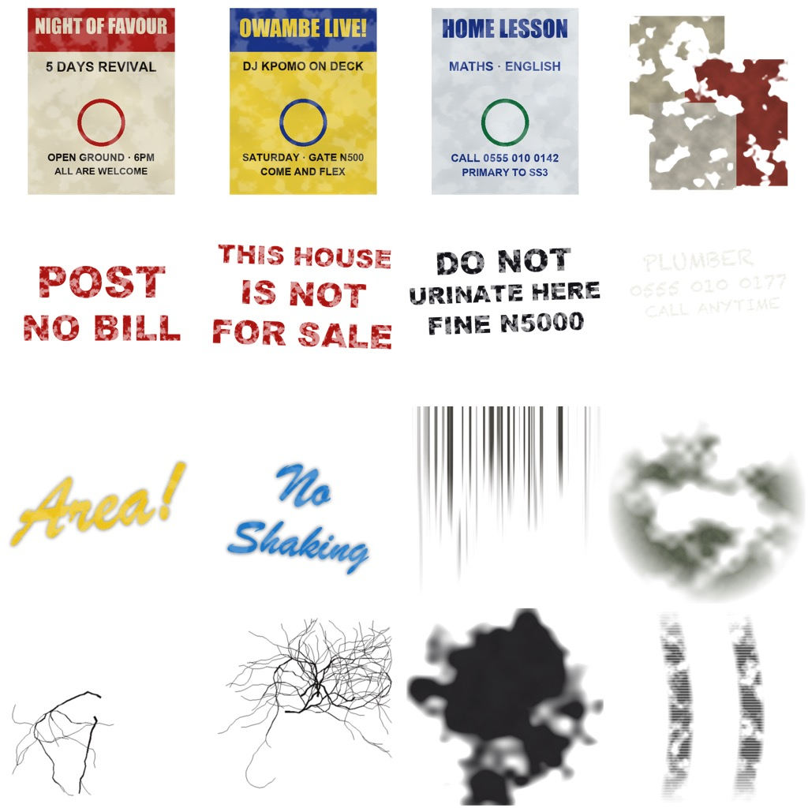
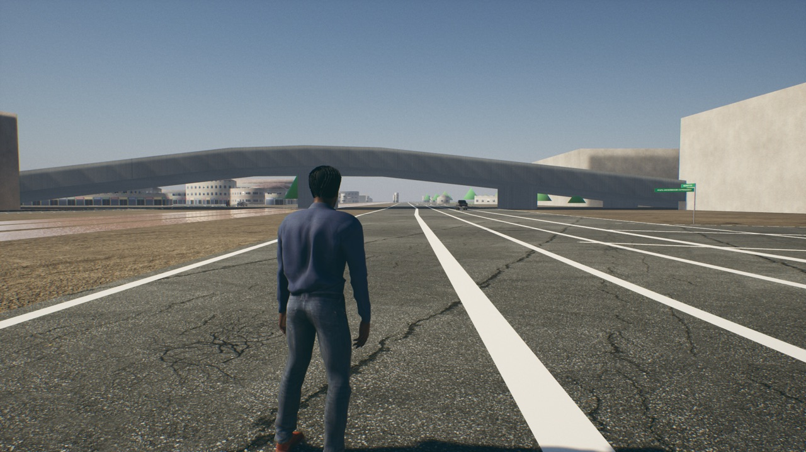

# Trim sheets and decals (Lagos look brief, section 5)

**Date:** 2026-10-09 · **Machine:** Apple M1, 8 GB · **Branch:** `lagos-real-city`

## What is in

- **Two trim sheets**, 2048 × 2048, three textures each (base colour, normal, packed occlusion/roughness/metallic): 19 strips in all.
- **One decal atlas**, 2048 × 2048, 16 decals in a 4 × 4 grid.
- **Materials:** `M_NH_Trim` and `M_NH_Trim_Cutout` (for bars and gates you can see through), one instance a sheet;
  `M_NH_Decal` and one instance a decal.
- **36 sample ground decals** (cracks, oil, skid marks) laid on 300 m of the Oshodi expressway.

Everything is **painted by a script from nothing**: no photographs, no downloads, no third-party art. That makes
them original and tiny, and it also means they are drawn, not scanned: they read as clean, simple shapes with wear
on top, not as photographs of Lagos metalwork.

| Frames sheet | Shop sheet |
|---|---|
|  |  |

| Decal atlas (on white; in the game the white is see-through) | In play: cracks on the expressway |
|---|---|
|  |  |

## The strips

A strip runs the full width of its sheet and repeats sideways. A model maps a long thin face onto one strip, so
every building shares the same three textures. Where each strip sits is in
`Plugins/NaijaHustleGame/Data/trim_sheets.json`, for the building kit to read.

| Sheet | Strips, top to bottom |
|---|---|
| Frames | aluminium window frame, painted wood frame, burglar bars (upright), burglar bars (diamond), glass louvres, concrete ledge, gutter, parapet cap, PVC pipe, tiled sill |
| Shop | roller shutter, shutter bottom rail with padlock plate, signboard frame, striped awning, folding security gate, steel door frame, terrazzo step, black-and-white kerb, wall tiles |

Metal and paint strips are light and neutral so the material's `Tint` can colour them. Other controls: `Dirt`
(darkens the hollows) and `RoughnessScale`.

## The decals

| Kind | Decals |
|---|---|
| Posters | revival night, owambe show, home lesson teacher, torn remains |
| Painted notices | "POST NO BILL", "THIS HOUSE IS NOT FOR SALE", "DO NOT URINATE HERE FINE N5000" |
| Scrawl and spray | plumber's number in chalk, "Area!", "No Shaking" |
| Stains | rain drips, rising damp |
| Ground | two cracks, oil spill, tyre marks |

All names and wording are made up; the posters show a plain ring where a face would be, so they picture nobody.
The two phone numbers start 0555, which I believe is not a Nigerian mobile prefix; I have not checked that against
the regulator's numbering plan.

## How to rebuild

1. `python3 Scripts/build_trims_decals.py` (needs `pip install numpy pillow`) paints the pictures into `~/Downloads/nh-trims` (5.8 MB, outside the project).
2. `Scripts/mac.sh script <plugin>/Scripts/import_trims_decals.py` imports them and builds the materials under
   `/Game/NaijaHustle/Surfaces/Trims`. `NH_TRIM_STAGE=city` redoes only the sample decals; `NH_DECAL_SPOT=X,Y,Yaw` moves them.

## Measured

Standalone game, 1280×720, Oshodi expressway, with the 36 decals in view.

| | Value |
|---|---|
| Frame rate, standing still | 36.1 fps (27.7 ms), 15-second average |
| Memory | 5.0 GB at the time of the measurement; 5.1 GB, peak 6.1 GB, on the run before |
| `Content/NaijaHustle/Surfaces/Trims` | 6.9 MB |
| `Content` in total | 2.1 GB (unchanged) |
| Project folder in total | 3.6 GB (unchanged) |

## Not done

- **No trim is on a building yet.** A trim sheet needs models whose faces are mapped onto its strips; those are the modular kit (section 6). So the sheets have been checked as pictures and as compiled materials, not on a wall in the game.
- **No wall decals are placed** (posters, notices, graffiti, stains). I tried to find walls automatically from the road and the search found none, so only ground decals are in. Wall decals go on with the kit.
- **Only the cracks have been seen in play.** Oil spills and tyre marks are placed on the same stretch but are not in the screenshot, and I have not checked them.
- **Two sheets, not three.** A third (roofs and rooftop services: tanks, AC units, cables) is better made alongside the kit pieces that need it.
- **No photo references were used.** You said you would send photos of Lagos street signs and streets; none have arrived, so shapes and colours are from general knowledge.
- Decals carry colour only: no normal map, so cracks are dark lines, not grooves.
